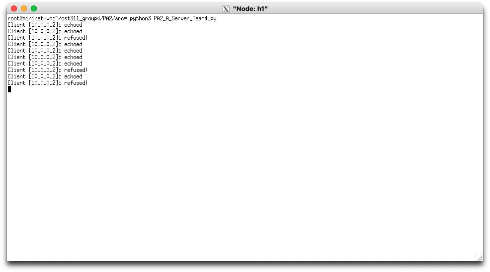
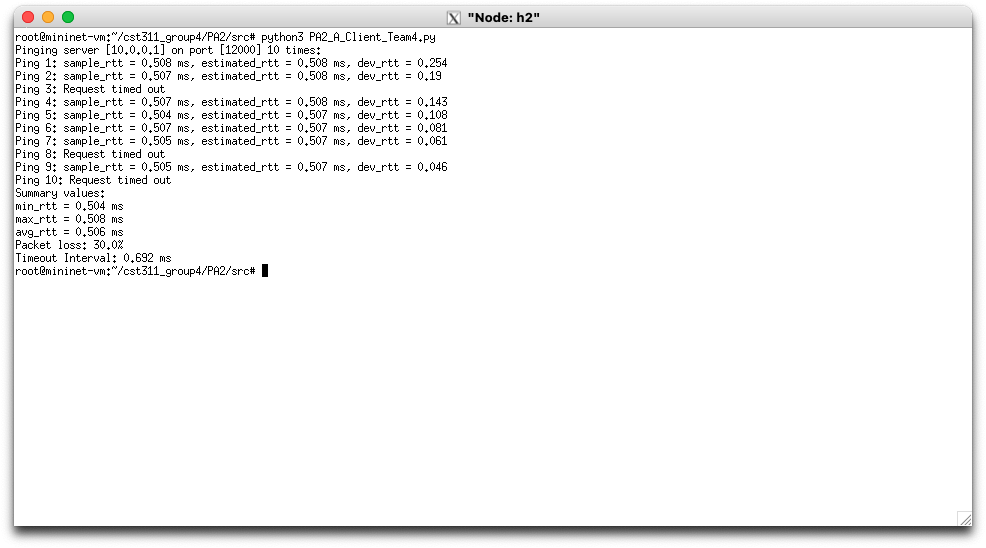

# Project 2: Server and Client Output

---

### Server Output:

The server is running on host h1 within Mininet.
The server determines whether or not to echo back 
the message it receives from the client.
If it chooses to do so, it prints out the client's 
IP address followed by either "echoed" or "refused!"

### Client Output:

The client is running on host h2 within Mininet. 
The client prints out the sample, estimate, and deviation 
of the round trip time after performing the calculation 
for each in milliseconds. All calculations are rounded 
to three decimal points. When the client program finishes running, 
a summary result is generated, which includes 
the minimum, maximum, and average round trip times in milliseconds. 
Additionally, the packet loss is printed as a percentage, and the 
timeout interval is calculated and displayed in milliseconds.
